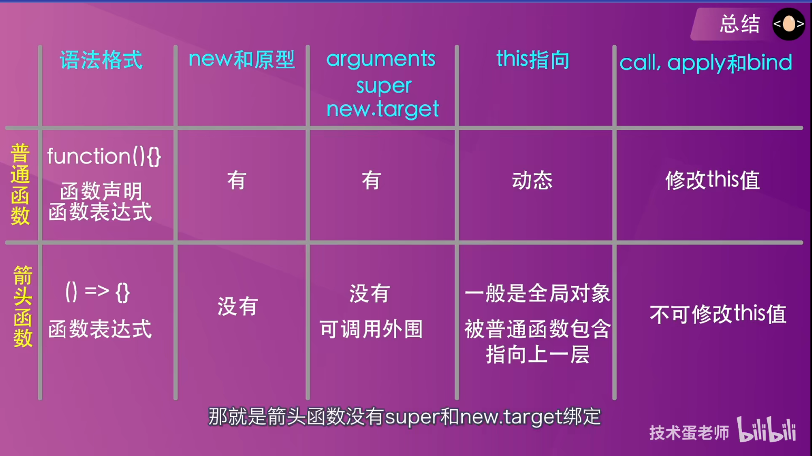
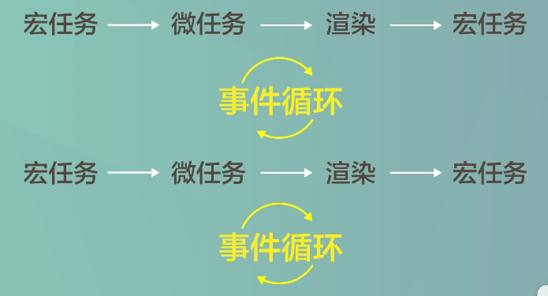
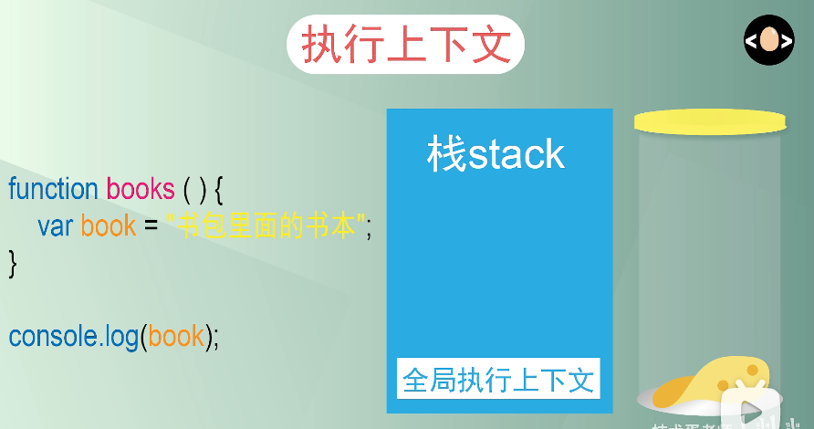
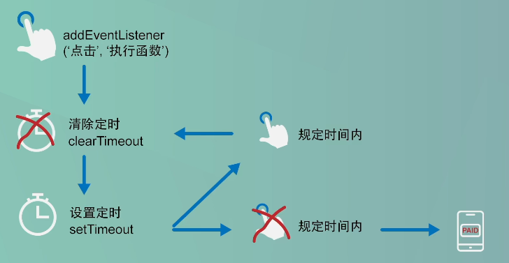

## 箭头函数

1. ```js
   const button1 = document.querySelector('.Button1')
   const button2 = document.querySelector('.Button2')
   const div1 = document.querySelector('.div1')
   const div2 = document.querySelector('.div2')
   
   let handle1 = function(){
       div1.innerHTML = "普通函数："+this; //指向点击的按钮对象
   }
   let handle2 = ()=>{
       div1.innerHTML = "箭头函数："+this; //指向Window
   }
   button1.addEventListener("click",handle1,false)
   button2.addEventListener("click",handle2,false)
   ```

2. ```js
   let normal = {
       bili:'Cao.F.Y',
       biubiu:function(){
           setTimeout(function(){
               console.log(this.bili); //指向window
           },10);
       }
   }
   let arrow = {
       bili:'hello world',
       biubiu:function(){
           setTimeout(()=>{
               console.log(this.bili); //指向arrow实例对象
           },10);
       }
   }
   normal.biubiu();
   arrow.biubiu();
   ```

3. 

## 常用数组方法

### map

> 是否会改变原数组（默认式不改变原数组）
>
> 数组中出现对象修改则会改变原数组

```js
let items = [
  {name: 'tom'},
  {name: 'tony'}
]
// good: 这样原数组不会影响
let result = items.map(item=> {
  return {
    ...item,
    gender: 'male'
  }
})
// bad: 这用会修改原数组
let result2 = items.map(item=> item.gender: 'male')  // 我之前总是这样用
```

### find

> 1. 找到数组的指定项
>
> 2. 用法和`map`相同

### filter

> 1. 过滤数组
> 2. 不会改变原数组

### forEach

> 1. 遍历数组
> 2. 改变原数组

### push

> 1. 数组后添加元素
> 2. 改变原数组

### every

> 1. 数组所有项满足指定条件
> 2. 返回true或false

### some

> 1. 数组有某项满足指定条件
> 2. 返回true或false

### findIndex

> 1. 返回满足条件的指定项的序号

## 宏任务微任务

> 1. 异步队列分为`微任务队列`和`宏任务队列`
>
> 2. 常见宏任务(硬菜)：绑定事件回调函数，setTimeout()和setInterval()
>
> 3. 常见微任务(软菜)：Primise.then().catch().finally()
>
> 4. `同步执行的代码为宏任务`，会先执行，然后再执行异步队列中先执行微任务再宏任务的规则(先清空调用栈，然后再执行任务队列)



## 闭包

> 1. js代码是由内到外执行

1. 执行上下文图片中不能输出`book`的值，是因为没有进入`books函数`的执行上下文（作用域）,全局环境不存在`book`

## setInterval

> 用setTimeout实现setInterval

```js
function newInterval(func, millisecond) {
    function inside() {
        func()
        setTimeout(inside, millisecond)
    }
    setTimeout(inside, millisecond)
}
newInterval(like, 3000)
function like() {
    console.log('我是传入参数')
}
```


## 防抖

> 1. 传入函数未点击执行
> 2. 清除还未定义的变量
> 3. 公用一个定时器（闭包）
> 4. this指向问题
> 5. 函数没有设置参数，也可以传入参数（arguments接收）

1. 执行流程
