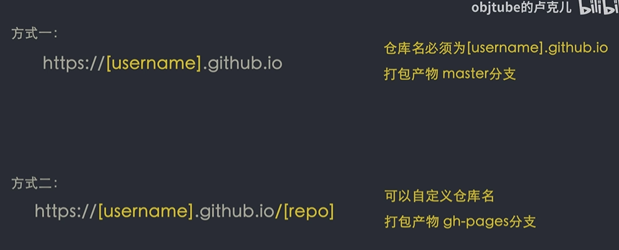

> **目标**
>
> 1. github pages 将博客部署到 github
> 2. github actions 实现自动化部署（不需要在本地进行代码的构建和打包）
> 3. 在线编辑文章

# 初始化项目

1. `hexo init hexo-blog` 创建项目

2. `hexo serve` 启动项目

# 主题配置

1. 把主题仓库克隆在 themes 文件夹里
2. 删除主题里面的 git 文件，把主题和博客项目合并成一个项目，同时用一个 git 管理
3. 删除默认主题
4. 在`_config.yml`文件修改主题名字

# github pages 部署

1. 创建 github 仓库
2. 仓库命名要求
3. 安装一个叫 hexo-deployer-git 的依赖（将生成好的代码部署到具体的分支）
4. 修改`_config.yml`文件

   ```json
   deploy:
     type: git
     repo: https://github.com/cfy1126/cfy1126.github.io
     branch: master
   ```

5. 运行`npm run deploy`或者`hexo deploy`部署代码
6. **master**分支的代码就是打包后生成的 public 的代码
7. github pages 查看站点是否被部署
8. 将源代码提交到新建的分支

# github action 自动化部署

1. 创建文件

```json
name: Build and Deploy
on: [push]
jobs:
  build-and-deploy:
    runs-on: ubuntu-latest
    steps:
      - name: Checkout 🛎️
        uses: actions/checkout@v2 # If you're using actions/checkout@v2 you must set persist-credentials to false in most cases for the deployment to work correctly.
        with:
          persist-credentials: false
      - name: Install and Build 🔧 # This example project is built using npm and outputs the result to the 'build' folder. Replace with the commands required to build your project, or remove this step entirely if your site is pre-built.
        run: |
          npm install
          npm run build
        env:
          CI: false
      - name: Deploy 🚀
        uses: JamesIves/github-pages-deploy-action@releases/v3
        with:
          GITHUB_TOKEN: ${{ secrets.GITHUB_TOKEN }}
          // 注意master把代码部署到master分支
          BRANCH: master # The branch the action should deploy to.
          // 代表把哪个文件夹部署在master分支里
          FOLDER: public # The folder the action should deploy.
```
